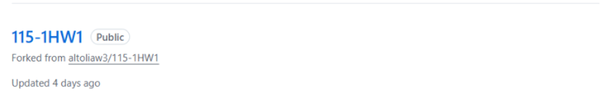
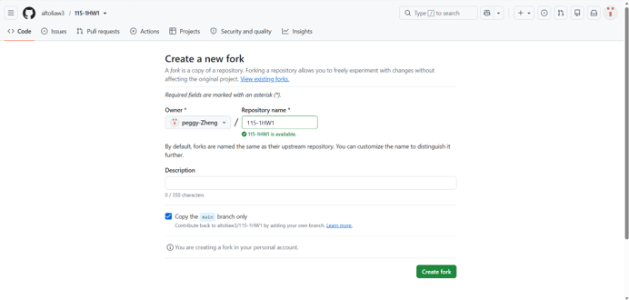
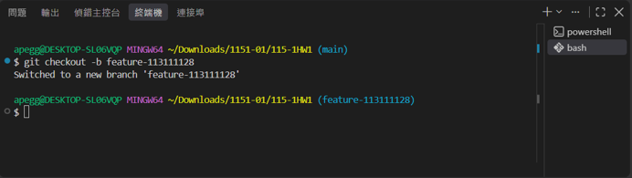
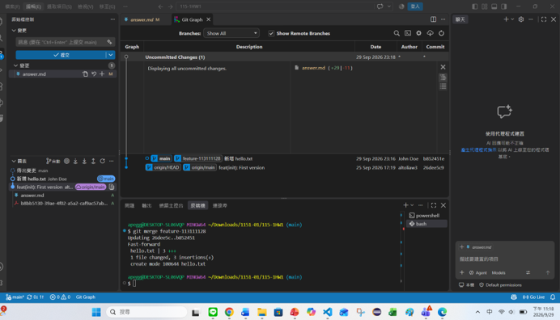

# 第1次作業題目-隨堂-HW1
>
>學號：113111128 (換成自己的)
><br />
>姓名：鄭姵妤 (換成自己的)
><br />
>作業撰寫時間：180 (mins，包含程式撰寫時間，換成自己的)
><br />
>最後撰寫文件日期：2026/09/29 (換成自己的)
>

本份文件包含以下主題：(至少需下面兩項，若是有多者可以自行新增)
- [x] 說明內容
- [x] 其他 (可以包含心得或是想跟老師反映)

## 說明內容

開始寫說明，該說明需說明想法，
並於之後再對上述想法的每一部分將程式進一步進行展現，
若需引用程式區則使用下面方法，
若為.cs檔內程式除了於敘述中需註明檔案名稱外，
還需使用語法` ```語言種類 程式碼 ``` `，其中語言種類若是要用python則使用py，java則使用java，C/C++則使用cpp，
下段程式碼為語言種類選擇csharp使用後結果：

```csharp
public void mt_getResult(){
    ...
}
```

若要於內文中標示部分網頁檔，則使用以下標籤` ```html 程式碼 ``` `，
下段程式碼則為使用後結果：

```html
<%@ Page Language="C#" AutoEventWireup="true" ...>

<!DOCTYPE html>

<html xmlns="http://www.w3.org/1999/xhtml">
<head runat="server">
<meta http-equiv="Content-Type" ...>
    <title></title>
</head>
<body>
    <form id="form1" runat="server">
        <div>
        </div>
    </form>
</body>
</html>
```
更多markdown方法可參閱[https://ithelp.ithome.com.tw/articles/10203758](https://ithelp.ithome.com.tw/articles/10203758)

請在撰寫"說明程式與內容"該塊內容，請把原該塊內上述敘述刪除，該塊上述內容只是用來指引該怎麼撰寫內容。

1. 請參閱Topic 0的 git clone 該⾴(P. 12)中，看完
fork內容後，請完成⽼師倉庫的fork，截圖並說明如何完成。 
Ans:登入至老師的倉庫作業頁面(115-1HW1)，點選右上角的「Fork」按鈕
在Fork設定頁面中，登入自已的github帳號，點選「Create Fork」按鈕
 

</br>

2. 請研究
markdown
基本寫作⽅法，並請對常⾒語法進⾏介紹後，請給個例⼦。
Ans:
#代表層級
# H1代表標題1 (標題 1，通常用於整篇文章的主標題，一篇文章建議只出現一）)
## H2代表標題2 (標題 2，用於主要章節的大標題)
### H3代表標題3（標題 3，用於小節標題）
粗體與斜體：雙星號包住變粗體（**文字**），單星號包住變斜體（*文字*）。
連結：用中括號和小括號建立連結文字（[顯示名稱](URL)）
圖片：在連結語法前加上驚嘆號 !（）。
格式：
範例：
!：驚嘆號代表這是一張圖片。
[]：這個符號[]是替代文字的意思，當圖片無法顯示時，畫面上將會出現這段文字。
()：這個符號()是，圖片網址圖片的網路連結（URL）或本機檔案路徑。
引用：在行首加上 > 建立引用區塊。
程式碼：單個反引號包住行內程式碼（`code`），三個反引號包住多行程式碼區塊。
</br>
3. 3-1建⽴新分⽀從main 
分⽀建⽴⼀條新分⽀，名稱⾃訂（例如:feature-你的學號），並切換到這條新分⽀
Ans:
建立並切換新分支
終端機要切換成git bash 在下方下這段程式 git checkout -b feature-113111128按下enter</br>
3-2在新分⽀上新增檔案並寫⼊內容在新分⽀上新增⼀個檔案（例如hello.txt），內容⾄少包含：
新增檔案並寫入內容新增一個檔案叫hello.txt在這個檔案裏面打字
打Hello git 姓名:鄭姵妤 學號:113111128好了之後，
到終端機下程式打git add hello.txt再打 git commit -m "新增 hello.txt"
再來合併分支git checkout main  j完成後再打  git merge feature-113111128 
 
 
4. 

Ans:

## 其他